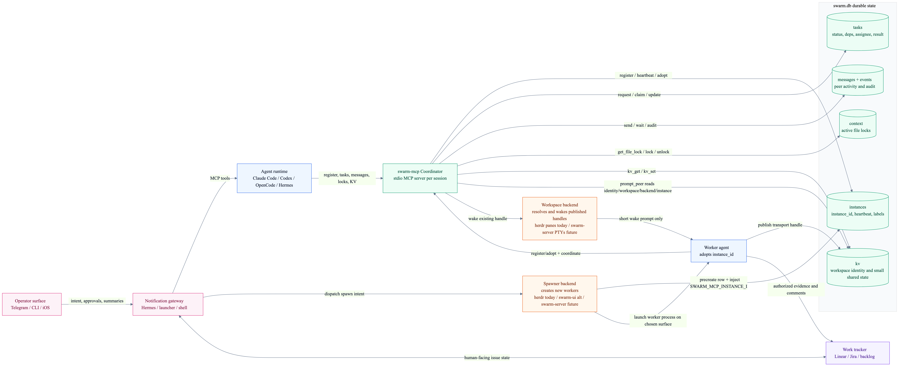

# swarm-mcp

MCP server that lets multiple coding-agent sessions on the same machine discover each other and collaborate through a shared SQLite database.

Each session spawns its own swarm-mcp server process via stdio. They all share one SQLite file at `~/.swarm-mcp/swarm.db` by default. No daemon needed.

[GitHub](https://github.com/Volpestyle/swarm-mcp)

---

## Quick start

If you want a first-run walkthrough, start with [`docs/getting-started.md`](./docs/getting-started.md). If you want the broader modular architecture this repo is growing toward, read [`docs/control-plane.md`](./docs/control-plane.md). Backend and consumer config lives in [`docs/backend-configuration.md`](./docs/backend-configuration.md).

Install dependencies:

```sh
cd /path/to/swarm-mcp
bun install
```

Add the server to your coding agent using that host's MCP config format. Bun is the simplest dev/runtime path because the examples use `bun run`, but the built `dist/*.js` entrypoints also run under Node 20+ with `better-sqlite3`.

### Codex (`~/.codex/config.toml`)

```toml
[mcp_servers.swarm]
command = "bun"
args = ["run", "/path/to/swarm-mcp/src/index.ts"]
cwd = "/path/to/swarm-mcp"
```

### opencode (`~/.config/opencode/opencode.json`)

```json
{
  "mcp": {
    "swarm": {
      "type": "local",
      "command": ["bun", "run", "/path/to/swarm-mcp/src/index.ts"],
      "enabled": true
    }
  }
}
```

### Claude Code (`~/.claude.json`)

```json
{
  "mcpServers": {
    "swarm": {
      "command": "bun",
      "args": ["run", "/path/to/swarm-mcp/src/index.ts"]
    }
  }
}
```

Tool names are usually namespaced by the client using the server name. Depending on the host you may see `swarm_register`, `mcp__swarm__register`, or other variants. Use whichever form your host exposes.

Call the swarm `register` tool first to join the swarm.

### Install the packaged skill

Mounting the MCP server makes the swarm tools available, but agents still benefit from the bundled `SKILL.md` workflow. If your host supports installable skills (Claude Code, OpenCode, Codex with skills, etc.), install [`skills/swarm-mcp`](./skills/swarm-mcp) for coordination. Symlink is recommended over copying so updates from `git pull` propagate automatically:

```sh
# In your consumer project root
mkdir -p .agents/skills .claude/skills
ln -s /absolute/path/to/swarm-mcp/skills/swarm-mcp .agents/skills/swarm-mcp
ln -s ../../.agents/skills/swarm-mcp .claude/skills/swarm-mcp
```

Or install globally for all projects:

```sh
mkdir -p ~/.claude/skills
ln -s /absolute/path/to/swarm-mcp/skills/swarm-mcp ~/.claude/skills/swarm-mcp
```

Then invoke `/swarm-mcp planner`, `/swarm-mcp implementer`, etc., when starting role-specialized sessions. Full per-host install paths and copy-based alternatives live in [`docs/install-skill.md`](./docs/install-skill.md).

### Further reading

- [`docs/getting-started.md`](./docs/getting-started.md) -- beginner-friendly setup and verification walkthrough
- [`docs/control-plane.md`](./docs/control-plane.md) -- modular agent workspace control-plane contracts and golden path
- [`docs/backend-configuration.md`](./docs/backend-configuration.md) -- consumer config layers, spawner/backend selection, and future swarm-server switch shape
- [`docs/agent-routing.md`](./docs/agent-routing.md) -- runtime-agnostic doctrine for swarm peers vs native subagents
- [`docs/identity-boundaries.md`](./docs/identity-boundaries.md) -- work/personal launcher, config, MCP auth, and routing boundaries
- [`env/`](./env) -- sourceable env-file templates for work/personal launchers and configured work trackers
- [`docs/install-skill.md`](./docs/install-skill.md) -- host-specific install paths for the packaged `swarm-mcp` skill
- [`docs/swarm-server.md`](./docs/swarm-server.md) -- Rust daemon for `swarm-ui`, mobile-style pairing, PTY streaming, and LAN access
- [`docs/database-contracts.md`](./docs/database-contracts.md) -- `swarm.db` schema ownership and adoption contract
- [`docs/design-batch-creation.md`](./docs/design-batch-creation.md) -- design spec for `request_task_batch`
- [`docs/testing/herdr-swarm-agent-metadata-review.md`](./docs/testing/herdr-swarm-agent-metadata-review.md) -- retrospective from a two-agent Herdr swarm metadata implementation test
- [`skills/swarm-mcp`](./skills/swarm-mcp) -- installable coordination skill — main `SKILL.md` plus role references (planner, implementer, reviewer, researcher, generalist, roles-and-teams, bootstrap, coordination, cli)
- [`.agents/skills`](./.agents/skills) -- repo-internal skills used while developing this repository
- [`integrations/hermes/`](./integrations/hermes/) and [`integrations/claude-code/`](./integrations/claude-code/) -- runtime plugins (lifecycle, lock bridge, `/swarm` slash command)

---

## MCP server vs swarm-server

The TypeScript `swarm-mcp` process is the stdio MCP server used by coding-agent hosts. It is enough for local multi-agent coordination through tools, resources, prompts, and the shared SQLite database. Its core job is the lightweight bus: instance identity, tasks, messages, locks, KV, and best-effort wakeups.

Spawner backends are adapters around that bus. The default adapter is `herdr`; `swarm-ui` remains available as a fallback/control-surface adapter. New terminal managers should plug in as spawner/workspace backends rather than changing the task/message/lock contract.

The Rust `apps/swarm-server` daemon is a separate desktop/mobile control plane. It serves `swarm-ui` over a local Unix socket, exposes HTTPS/WSS on port 5444 for paired clients, manages PTYs, and reads the same `swarm.db`. It is not required for the basic MCP setup above. The current `apps/swarm-ios` workstream is Herdr-bridge first so Herdr remains the universal PTY owner; `swarm-server` remains useful reference material and the daemon for `swarm-ui`. See [`docs/swarm-server.md`](./docs/swarm-server.md).

## Control-plane overview



Source: [`docs/diagrams/backend-configuration.mmd`](./docs/diagrams/backend-configuration.mmd). Backend selection and workspace identity conventions are centralized in [`docs/backend-configuration.md`](./docs/backend-configuration.md).

---

## How it works

All sessions read and write to `~/.swarm-mcp/swarm.db` by default using WAL mode, auto-vacuum, and a 3s busy timeout. Bun uses `bun:sqlite`; Node uses `better-sqlite3`.

Set `SWARM_DB_PATH` before launching the server if you want a different database location.

When you call `register`, the server starts a 10s heartbeat and a 5s notification poller.

### Registration fields

The `register` tool accepts these parameters. Only `directory` is required.

| Field | Required | Description |
|-------|----------|-------------|
| `directory` | Yes | The live working directory for the current session. |
| `scope` | No | Shared swarm boundary. Sessions in the same scope can see each other; different scopes are different swarms. Defaults to the detected git root, or to `directory` when no git root exists. Use a new scope only for a separate swarm; do not split frontend/backend inside one repo with scope. Use `team:` label tokens for that. |
| `file_root` | No | Canonical base path for resolving relative file paths in `lock_file` and task `files`. Useful when disposable worktrees should share one logical file tree. |
| `label` | No | Free-form identity text. Recommended convention: machine-readable space-separated tokens like `identity:work provider:codex-cli role:planner`. The `identity:` token should match the launcher/config root when using identity separation. The `role:` token is optional; if missing, the session is treated as a generalist. |

### Task features

Tasks support several features for building autonomous DAG-based workflows:

| Feature | Description |
|---------|-------------|
| `priority` | Integer (default 0). Higher = more urgent. `list_tasks` returns tasks sorted by priority descending. Implementers claim the highest-priority open task first. |
| `depends_on` | Array of task IDs. A task with unmet dependencies starts as `blocked` and auto-transitions to `open` when all deps reach `done`. If any dependency fails, downstream tasks are auto-cancelled. |
| `idempotency_key` | Unique string. If a task with this key already exists, `request_task` returns the existing task instead of creating a duplicate. Essential for crash-safe plan retries. |
| `parent_task_id` | Optional parent task ID for tree-structured work tracking. |
| `approval_required` | If true, task starts in `approval_required` status and must be approved via `approve_task` before work begins. Use this for true approval gates, not routine code review. |

Task statuses: `open`, `claimed`, `in_progress`, `done`, `failed`, `cancelled`, `blocked`, `approval_required`.

### Session resets and prompt compaction

If a host compacts context, starts a fresh window, or loses the previous bootstrap, rejoin the swarm the same way:

1. Call `register` again.
2. Rehydrate with `bootstrap`.
3. For planners, also check `kv_get("owner/planner")` and `kv_get("plan/latest")`.

The durable coordination state lives in the shared database, not in repeated per-tool prompt text.

---

## Auto-cleanup

| Data                                           | TTL        |
| ---------------------------------------------- | ---------- |
| Stale marker (no heartbeat)                    | 30 seconds |
| Offline instance reclaim                       | 60 seconds |
| Messages                                       | 1 hour     |
| Completed/failed/cancelled tasks               | 24 hours   |
| Events                                         | 24 hours   |
| Orphaned `progress/` + `plan/<instance-id>` KV | 1 hour     |

When a session reaches the offline reclaim window, claimed or in-progress tasks are released back to `open` and that session's file locks are removed.

File locks stay exclusive and are cleared when the owning instance is reclaimed offline, deregisters, or completes the owning task.

Run `swarm-mcp cleanup --dry-run --json` to inspect what the janitor would remove without mutating the shared database.

---

## Tools

### Instance registry

| Tool              | Description                                                                                                          |
| ----------------- | -------------------------------------------------------------------------------------------------------------------- |
| `register`        | Join the swarm. Starts heartbeat + notification poller. See [Registration fields](#registration-fields). |
| `deregister`      | Leave the swarm gracefully. Releases tasks and locks.                                                                |
| `bootstrap`       | Yield-checkpoint read for current instance, peers, unread messages, tasks, and configured work tracker metadata. |
| `list_instances`  | List all live instances.                                                                                             |
| `remove_instance` | Forcefully remove another instance. Releases its tasks and locks.                                                    |
| `whoami`          | Get this instance's swarm ID.                                                                                        |

### Messaging

| Tool                | Description                                                                                                    |
| ------------------- | -------------------------------------------------------------------------------------------------------------- |
| `send_message`      | Send a direct message to a specific instance by ID.                                                            |
| `prompt_peer`       | Send a durable swarm message, then best-effort wake the target's workspace handle. Busy handles are not interrupted unless forced. |
| `resolve_workspace_handle` | Map a transport-local workspace handle, such as a herdr pane, back to a swarm instance ID. |
| `broadcast`         | Message all other instances in the swarm.                                                                      |
| `poll_messages`     | Read unread messages and mark them as read.                                                            |
| `wait_for_activity` | Block until new messages, task changes, KV changes, or instance changes arrive. Use only while actively monitoring a peer/dependency/review/lock, not as a generic idle loop. |

### Task delegation

| Tool                 | Description                                                                                                               |
| -------------------- | ------------------------------------------------------------------------------------------------------------------------- |
| `request_task`       | Post a task (types: `review`, `implement`, `fix`, `test`, `research`, `other`). Use `review` for routine code review handoff. Supports `priority`, `depends_on`, `idempotency_key`, `parent_task_id`, and `approval_required`. |
| `request_task_batch` | Create multiple tasks atomically in a single transaction. Supports `$N` references (1-indexed) for intra-batch dependencies. |
| `dispatch`           | Gateway-only: create/reuse a task, wake a matching live worker, or spawn through the configured spawner backend. Ordinary workers should not call this. |
| `claim_task`         | Start work on a task: assigns and transitions to `in_progress` in one call. Prevents double-claiming and blocks on unread messages until `poll_messages` (or explicit override). Also accepts tasks pre-assigned to you (status=`claimed`). |
| `update_task`        | Move a task to a terminal status (`done`, `failed`, `cancelled`). Auto-releases the actor's locks on the task's files. Attach a result when useful. |
| `approve_task`       | Approve a task in `approval_required` status. Transitions to `open`/`claimed` (or `blocked` if deps unmet).               |
| `get_task`           | Get full details of a task.                                                                                               |
| `list_tasks`         | Filter tasks by status, assignee, or requester. Sorted by priority (highest first).                                       |

### File locking

| Tool             | Description                                                   |
| ---------------- | ------------------------------------------------------------- |
| `get_file_lock`  | Read active lock state for a file without acquiring a lock. |
| `lock_file`      | Acquire a file lock. Re-entrant for the same instance by default; pass `exclusive=true` to conflict on any existing lock (including same-instance) for one-shot mutexes like spawn coordination. Locks auto-release on terminal `update_task`. |
| `unlock_file`    | Release a file lock early (before the task as a whole completes). |

### Key-value store

| Tool        | Description                                    |
| ----------- | ---------------------------------------------- |
| `kv_get`    | Get a value by key.                            |
| `kv_set`    | Set a key-value pair visible to all instances. |
| `kv_append` | Atomically append a JSON value to a KV array.  |
| `kv_delete` | Delete a key.                                  |
| `kv_list`   | List keys, optionally filtered by prefix.      |

---

## CLI

The same `swarm-mcp` binary exposes a non-MCP CLI that talks directly to `~/.swarm-mcp/swarm.db`. Use it from contexts that cannot speak MCP: shell scripts, helper scripts an agent invokes (e.g. a test harness or CLI referee), cron jobs, CI, an ad-hoc terminal for inspection/debugging, or to control a running `swarm-ui` app.

Inside an MCP-enabled agent session, prefer the MCP tools for swarm coordination primitives (`register`, messages, tasks, locks, KV). The CLI is primarily for scripts, operator terminals, and the `swarm-ui` control surface.

Launcher-managed sessions may set `SWARM_MCP_BIN` to a real command such as
`bun run /path/to/swarm-mcp/src/cli.ts`. Agents should use that prefix instead
of assuming `swarm-mcp` is installed on `PATH`.

Setup helper:

```sh
swarm-mcp init --dir /path/to/project   # write .mcp.json and copy the packaged swarm-mcp skill
swarm-mcp init --no-skills              # write only the MCP config
```

`init` writes a project `.mcp.json` entry that runs `npx -y swarm-mcp` and, unless `--no-skills` is passed, copies `skills/swarm-mcp` into `.claude/skills/`. Manual host-specific MCP configs are still useful when your host does not read `.mcp.json` or you want to run from a local clone.

Inspection:

```sh
swarm-mcp inspect                    # unified dump of instances, tasks, kv, locks, recent messages
swarm-mcp inspect --scope /path      # pin to an explicit scope
swarm-mcp messages --from <who>      # peek (does not mark read)
swarm-mcp cleanup --dry-run --json   # inspect cleanup without deleting
swarm-mcp kv list --prefix pixel:
swarm-mcp kv get pixel:turn
```

Writes (require identity — pass `--as <uuid | prefix | unique-label-substring>` or set `SWARM_MCP_INSTANCE_ID`; falls back to the sole live instance in scope):

```sh
swarm-mcp send --to <who> "message text"
swarm-mcp broadcast "status update"
swarm-mcp kv set  <key> <value>
swarm-mcp kv append <key> <json-value>
swarm-mcp kv del  <key>
swarm-mcp lock    <file> --note "why"
swarm-mcp unlock  <file>
```

Swarm UI control:

```sh
swarm-mcp ui spawn /path/to/repo --harness codex --role planner
swarm-mcp ui prompt --target role:planner "check the failing tests"
swarm-mcp ui move --target bound:<instance-id> --x 120 --y 80
swarm-mcp ui organize --kind grid
swarm-mcp ui list
```

These commands enqueue work for a running `swarm-ui` app to claim and execute. If no desktop app is running, commands remain `pending` until one starts.

Notes:

- `swarm-mcp ui spawn`, `ui prompt`, `ui move`, and `ui organize` wait up to 5 seconds by default for the desktop app to claim + complete the command. Pass `--wait 0` to return immediately after enqueue.
- `ui spawn` accepts the work-identity launchers `--harness claude` / `--harness codex` / `--harness opencode` / `--harness hermesw` (and `--harness clawd` for Claude with `--enable-auto-mode`) and the personal-identity launchers `--harness clowd` / `--harness cdx` / `--harness opc` / `--harness hermesp`; omit `--harness` for a plain shell. Pick the launcher whose identity matches the worker you intend to spawn — see [identity boundaries](docs/identity-boundaries.md).
- Identified `dispatch` / `ui spawn` callers must be registered with a `mode:gateway` label. Trusted operator shells can bypass that accidental-use guard with `SWARM_MCP_ALLOW_SPAWN=1`.
- Use `swarm-mcp ui list` and `swarm-mcp ui get <id>` to inspect queued, running, completed, or failed UI commands.
- `--target` accepts `bound:<instance-id>`, `instance:<instance-id>`, `pty:<pty-id>`, or a bare instance / PTY reference. Bare instance refs resolve by full UUID, unique UUID prefix, or unique label substring in scope. Bare PTY refs resolve by full PTY id, unique PTY id prefix, or a unique substring of the PTY command.
- `ui move` persists layout into the shared `ui/layout` KV entry for the target scope, so changes survive refreshes and can be driven from either the desktop UI or the CLI.
- `ui organize` currently supports only `--kind grid`.

State, write, and UI subcommands accept `--json` for machine-readable output where shown by `swarm-mcp help`.

Canonical helper-script pattern — a harness the agent invokes to do validation + state update + handoff in one shot:

```js
// harness.mjs — run as `node harness.mjs <partner-id>` by an agent
import { execFileSync } from "node:child_process";
const me = process.env.SWARM_MCP_INSTANCE_ID;
const scope = process.env.SWARM_MCP_SCOPE;
// ... validate and write artifacts ...
execFileSync("swarm-mcp", ["kv", "set", "turn", JSON.stringify(next), "--scope", scope, "--as", me]);
execFileSync("swarm-mcp", ["send", "--to", partner, "your turn", "--scope", scope, "--as", me]);
```

Security note: `--as` trusts the caller. The CLI will write as any live instance. Do not expose this binary to untrusted callers — the security model is the same as the underlying shared SQLite file.

---

## Resources

The server exposes 4 MCP resources. `swarm://inbox`, `swarm://tasks`, and `swarm://instances` are refreshed by the background poller when the host supports resource update notifications.

| URI                        | Description                                |
| -------------------------- | ------------------------------------------ |
| `swarm://inbox`            | Unread messages for this instance.         |
| `swarm://tasks`            | Tasks grouped by status, including open, claimed, in-progress, blocked, approval-required, done, failed, and cancelled. |
| `swarm://instances`        | All active instances.                      |
| `swarm://lock?file=...`    | Active lock state for a specific file.      |

---

## Prompts

The server exposes MCP prompts. Some hosts surface them directly, while others only expose tools and resources.

| Prompt | Purpose |
| ------ | ------- |
| `setup` (often shown as `swarm:setup`) | Guides the agent through registration: call `register`, then `bootstrap`, then summarize swarm ID, active sessions, role labels, open tasks, and coordination risks. |
| `protocol` (often shown as `swarm:protocol`) | Applies the recommended coordination workflow for the session: inspect locks before editing, lock while editing, use messages/tasks for handoff, and inspect `role:` labels when choosing collaborators. |

---

## Coordination doctrine

For autonomous collaboration, agent doctrine lives in the bundled **`swarm-mcp` skill** rather than in copy-paste `AGENTS.md` snippets. The skill carries a short main `SKILL.md` plus on-demand references for each role:

| Role | Reference |
|------|-----------|
| Generalist (no `role:` token) | [`skills/swarm-mcp/SKILL.md`](./skills/swarm-mcp/SKILL.md) |
| Planner | [`skills/swarm-mcp/references/planner.md`](./skills/swarm-mcp/references/planner.md) |
| Implementer | [`skills/swarm-mcp/references/implementer.md`](./skills/swarm-mcp/references/implementer.md) |
| Reviewer | [`skills/swarm-mcp/references/reviewer.md`](./skills/swarm-mcp/references/reviewer.md) |
| Researcher | [`skills/swarm-mcp/references/researcher.md`](./skills/swarm-mcp/references/researcher.md) |
| Roles, teams, handoff patterns | [`skills/swarm-mcp/references/roles-and-teams.md`](./skills/swarm-mcp/references/roles-and-teams.md) |
| Work tracker linkage | [`skills/swarm-mcp/references/work-trackers.md`](./skills/swarm-mcp/references/work-trackers.md) |
| Bootstrap fields, KV/coordination, CLI | [`bootstrap.md`](./skills/swarm-mcp/references/bootstrap.md), [`coordination.md`](./skills/swarm-mcp/references/coordination.md), [`cli.md`](./skills/swarm-mcp/references/cli.md) |

On hosts that support installable skills, invoke `/swarm-mcp planner`, `/swarm-mcp implementer`, etc. On hosts without skill support, point your `AGENTS.md` (or equivalent) at `skills/swarm-mcp/SKILL.md` — it doubles as a readable doctrine file.

For runtime-agnostic routing doctrine that should always be loaded (not on-demand), see [`docs/agent-routing.md`](./docs/agent-routing.md). Runtime plugins ([`integrations/hermes/`](./integrations/hermes/), [`integrations/claude-code/`](./integrations/claude-code/)) automate registration, locking, and the `/swarm` slash command on top of the skill.

If your host exposes MCP prompts, you can also use the built-in `protocol` prompt (often shown as `swarm:protocol`) to pull the workflow into a session on demand.

## Skills

This repo ships the reusable consumer skill at [`skills/swarm-mcp`](./skills/swarm-mcp). Repo-internal skills live under [`.agents/skills`](./.agents/skills) and are not packaged by default.

Use `swarm-mcp` when your host supports installable `SKILL.md` workflows and you want agents to learn the swarm protocol more reliably. Invoke role-specific workflows with `/swarm-mcp planner`, `/swarm-mcp implementer`, `/swarm-mcp reviewer`, or `/swarm-mcp researcher`. For install locations, see [`docs/install-skill.md`](./docs/install-skill.md).

Use skills in addition to minimal always-on instructions, not instead of them. A skill is a playbook; `AGENTS.md` is still the best place for ambient rules like "register early" and "check locks before editing."

The skills do not mount the MCP server for you. They assume the `swarm` MCP tools are already available in the session.

---

## Troubleshooting

**Sessions can't see each other.** Check that both sessions registered with the same `scope` (or both defaulted to the same git root). Verify they are using the same database path (`~/.swarm-mcp/swarm.db` by default). Run `list_instances` in both sessions.

**Tools aren't available after config change.** Most hosts only load MCP server changes at startup. Restart the application or start a fresh session after editing the MCP config.

**File locks are stuck.** Stale locks are cleared automatically when the owning instance's heartbeat expires (30s). If you need to clear them manually, delete the row from the `context` table in the SQLite database, or restart the stuck session.

**Inspecting the database directly.** The database is a standard SQLite file at `~/.swarm-mcp/swarm.db`. You can open it with any SQLite client (`bun` itself, `sqlite3`, DB Browser for SQLite, etc.) to inspect instances, tasks, messages, locks, and KV.

**Wrong absolute path in server command.** The `bun run` command needs an absolute path to `src/index.ts`. Relative paths may resolve differently depending on how the host launches the process.

---

## Security

All sessions on the same machine share one SQLite file. Any process running as the same OS user can read and write to it. There is no authentication or authorization between sessions.

This is intentional for a local development tool. Do not use swarm-mcp across trust boundaries or expose the database to untrusted users.

---

## License

[MIT](./LICENSE)
