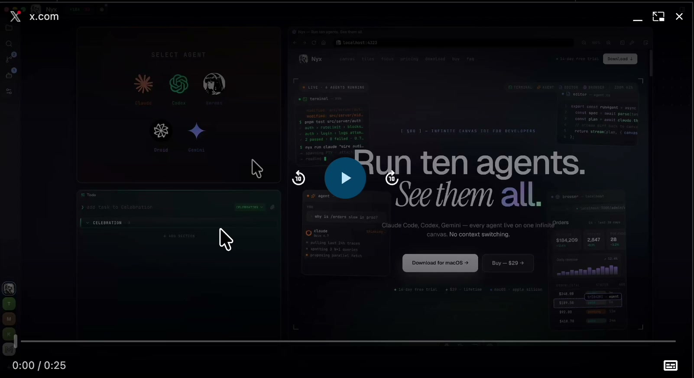
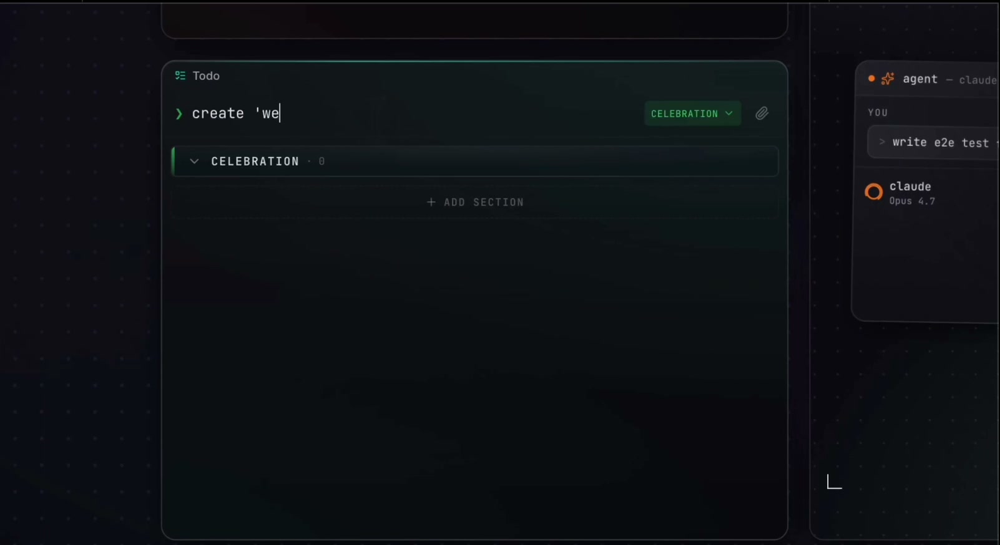
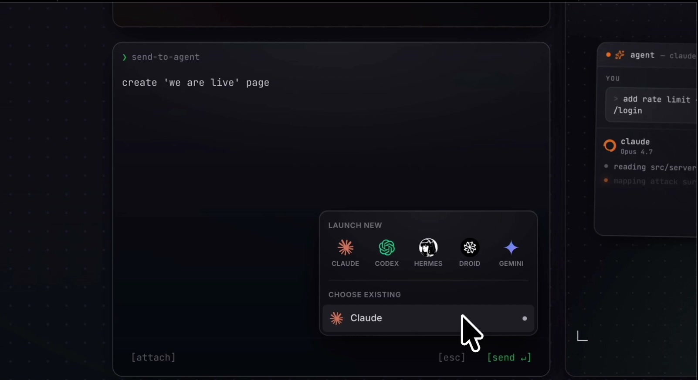
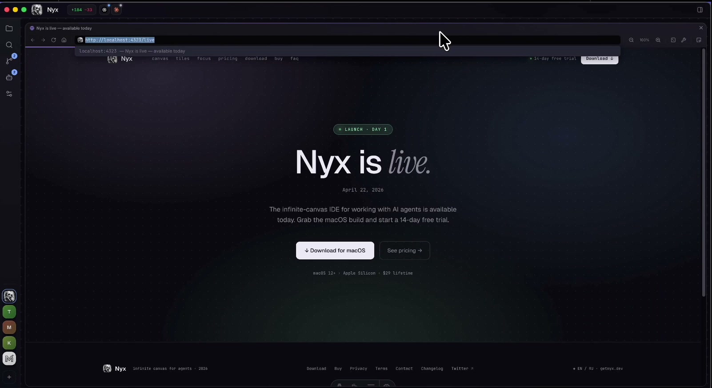
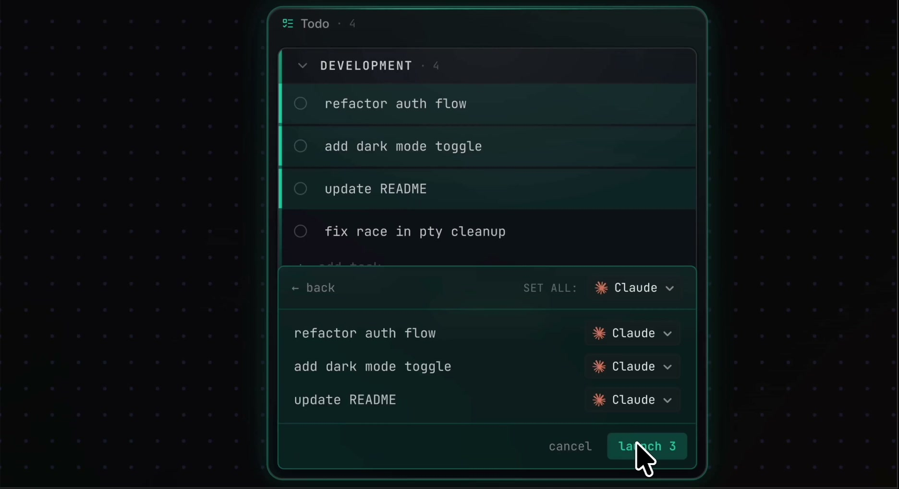
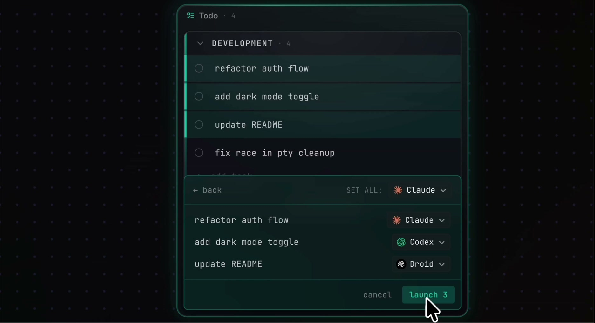
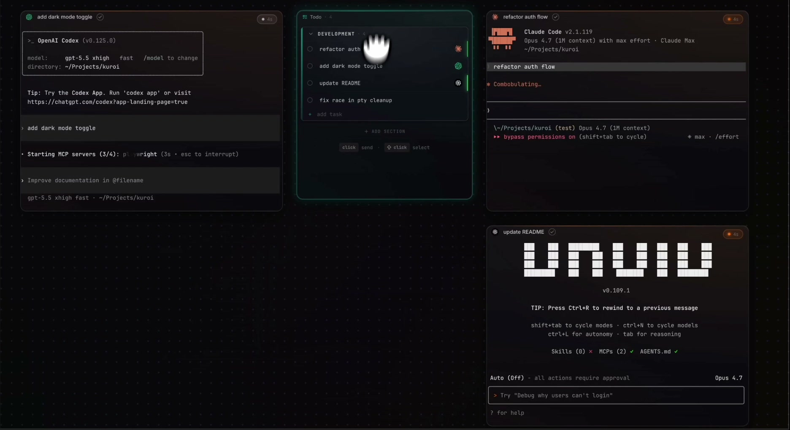
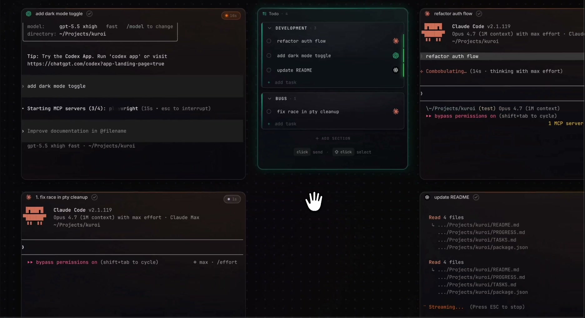
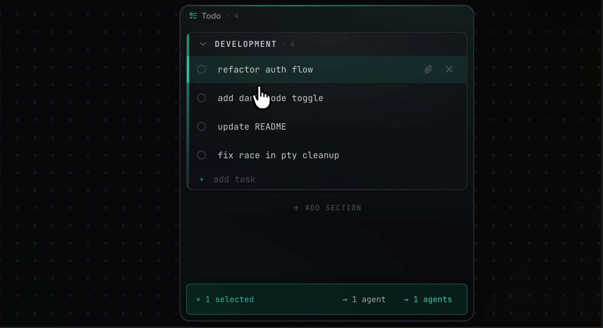

# May 1st Overhaul Plan

> Status: planning authority draft for `swarm-mcp-lab`.
> Scope: product overhaul, visible workflow, competitive gap closure, and execution sequencing.
> Rule: stages are logical, not calendar estimates.

Execution companion docs:

- `docs/MAY_1ST_EXECUTION_BOOTSTRAP.md` defines the first concrete MVP slices and the temporary meaning of Grand Architect / Majordomo before full automation exists.
- `docs/MAY_1ST_PLAN_ARCHIVE.md` marks previous phase plans as historical/source material so agents do not resume stale Phase 4/5/6 work by accident.

## Goal

Turn `swarm-mcp-lab` from a powerful but clutter-prone coordination lab into an intuitive local agent workbench where a user can open any project, write or import a plan, split it into tasks, launch an agent team, watch real progress, and safely resume or clean up sessions.

The product should feel project-agnostic, fast, visible, and serious. The first successful demo is not "many terminals on a canvas." The first successful demo is:

1. Open any folder.
2. Create or import a plan.
3. Convert plan items into task rows.
4. Select several rows.
5. Assign agents.
6. Launch the team.
7. Watch each agent listen, work, report, and complete its task.
8. Review results, commits, files, context, and leftovers from one clear surface.

## May 2 UX Correction: Hide The Plumbing

This is an amendment to the May 1st overhaul, not a competing plan.

The May 1st product spine remains the authority: **Open Project -> Project Cockpit -> Task Board -> task-bound agents -> listener/task status.** The May 2 correction tightens the user model so the app feels like a project workbench, not a launch/debug console.

User-facing happy path:

- Project is the primary work container.
- Task is what the user delegates.
- Agent is the worker object on the canvas.
- Conversation is how the user and agents coordinate.

Internal machinery:

- Directory is project-root metadata, not the main user choice.
- Channel/scope is internal routing for swarm coordination, not something the user should choose during normal launch.
- Model, harness, permissions, command, and exact scope remain available in Advanced, Debug, or incongruency preflight.
- Saved agents are templates by default. They launch into the current project/session unless explicitly marked as pinned to a project or internal channel.
- "All channels" is the normal broad view for visibility, not a launch target the user has to reason about.

Product rule:

- If the normal path asks the user to decide between directory, scope, channel, launch profile, saved agent, model, and role before they can start work, the UI is exposing the wrong layer.
- Preflight confirmations should appear for true incongruencies, not every ordinary launch.

### May 2 Sidecar Status: Launch, Conversation, And Listening Reliability

This sidecar is not the main May 1 MVP. It exists because the May 1 loop depends on agents launching into the right project/session and visibly responding to the operator. Treat it as reliability scaffolding around the project-first overhaul.

Done:

- Integrated the May 2 UX correction into this May 1 plan, the execution bootstrap, the plan archive, and the execution status. There is still one active overhaul plan.
- Added a Conversation panel `Copy convo` action that exports the visible conversation as Markdown for outside agents or handoff context.
- Added a reliable top-level Advanced toggle in the Launcher so the lower advanced area is no longer the only way to reach manual launch/profile/team controls.
- Added launch preflight review logic for individual and team launches. It checks resolved working directory, command source, role, launch scope, active feed, online peers in the target scope, shell/no-harness launches, and command/profile mismatch warnings.
- Added native login-shell command preflight for saved commands and provider aliases. It reports executable resolution, PATH preview, diagnostics, warnings, and blockers before PTY spawn.
- Added full-access trust posture classification for `flux`, `flux9`, dangerous bypass flags, skip-permission flags, and no-sandbox style commands.
- Project Task Board launch now stays modal-free on the happy path, but rows show `preflighting`, `preflight ok`, `preflight full access`, or a launch-blocking error before spawn.
- Added server-side standby registration language so newly registered agents treat `operator:` broadcasts as valid conversation/status messages while still refusing unassigned repo work.
- Added UI bootstrap language with the same protocol: answer operator chat/status in the shared Conversation panel, clarify ambiguous action items, and only start code work when directly assigned or task-assigned.
- Added focused regression coverage for launch scope/preflight helpers, conversation export, UI bootstrap prompt, server standby prompt, and prompt protocol language.

Verified so far:

- `bun test apps/swarm-ui/src/lib/launcherConfig.test.ts apps/swarm-ui/src/lib/bootstrapPrompt.test.ts apps/swarm-ui/src/lib/conversationExport.test.ts test/prompts.test.ts`
- `bun test test/prompts.test.ts apps/swarm-ui/src/lib/bootstrapPrompt.test.ts`
- `bun run typecheck`
- `cd apps/swarm-ui && bun run check`
- `bun run check` on 2026-05-02
- `cd apps/swarm-ui && bunx tauri build --debug` on 2026-05-02 after targeted cleanup of stale Tauri/Cargo artifacts
- Browser smoke verified the Launcher Advanced control and the launch preflight modal path in the Vite surface.

Still needs doing or testing:

- Rebuild/relaunch the MCP server path used by newly spawned agents if the active launcher is consuming built `dist/` output, then verify a fresh standby agent responds to an operator broadcast like "yo anybody home?" with a short shared Conversation reply.
- Verify the same behavior in the installed/Tauri app, not only the Vite/browser surface.
- Convert Advanced Launch preflight from always-confirm to incongruency-only if it becomes too chatty. Project Task Board already avoids a modal on the happy path and records row-level blockers instead.
- Add `Copy Debug Pack` as an Advanced/Diagnostics action. It should include active project, internal channel/scope, all agent rows, recent messages, recent MCP audit events, PTY bindings/session ids, launch truth, console errors if available, and build/version info.
- Add the first AI Visual QA Pack as review acceleration, not a new product surface. It should combine semantic snapshots, targeted element screenshots, scroll-container passes, and small motion frame samples so agents can inspect theme, overflow, and animation issues without losing the lower page or nested panels.
- Confirm `Copy convo` works through the real system clipboard in Tauri and includes enough context for an outside agent without dumping unrelated channels.
- Confirm Team Launch, saved-agent launch, shell launch, and quick preset launch all use the same project-first assumptions and do not silently inherit stale scope/directory state.
- Confirm "All channels" behaves as a broad visibility view, not a launch target the user must reason about.
- Fold any surviving scope/channel copy in Home, Project Cockpit, Task Board, and Launcher into Advanced/Debug wording unless it is needed to explain an incongruency.
- Run a human-visible installed-app smoke before calling this sidecar complete. The full root check and debug bundle build are green as of 2026-05-02.

## Competitive Trigger

Two Nyx videos and the current Nyx feature copy show a fast-moving competitor building publicly around the same broad category:

- Infinite canvas AI IDE for multiple coding agents.
- Agent picker for Claude, Codex, Droid, OpenCode, Gemini, Hermes.
- Todo list where each task can become a parallel agent.
- Agent tiles spawned next to the list.
- Tasks auto-check when their assigned agent finishes.
- Persistent agent sessions through a background PTY daemon.
- Conversation resume across multiple CLIs.
- Menu bar active-agent count.
- Native macOS notifications.
- Idle auto-suspend.
- Workspace switching that keeps agents alive.
- Terminal/script selection sent to agent.
- Multi-scope AI commit messages.
- Copy Path and Copy Relative Path convenience.
- Dangerous permissions toggle for Claude Code.
- Shell PATH inheritance fixes.
- Batch launch orphan-daemon cleanup.

## Video Screenshot References

These screenshots were extracted from the local reference videos:

- `/Users/mathewfrazier/Movies/TapRecord/Video/Nyx insp.mp4`
- `/Users/mathewfrazier/Movies/TapRecord/Video/Todo List Nyx.mp4`

Use them as product-reference evidence only. Do not copy Nyx pixel-for-pixel. The point is to understand the visible workflow gap, then build a stronger `swarm-mcp` version with real task, project, listener, context, and session semantics underneath.

### R1: First-Read Marketing Message



Reference value:

- One-line product promise is instantly legible.
- Provider icons and the todo panel are visible in the first frame.
- Main takeaway for this overhaul: our first screen needs one clear operational promise, not a pile of controls.

### R2: Task Composer



Reference value:

- Task entry is close to the canvas.
- Section assignment is visible.
- Main takeaway for this overhaul: task creation must feel immediate and lightweight.

### R3: Existing/New Agent Picker



Reference value:

- New agent and existing agent paths are in one compact menu.
- Provider choice is easy to scan.
- Main takeaway for this overhaul: our picker must be just as quick, but richer: provider, role, trust posture, project, channel, and session mode.

### R4: Result Page Preview



Reference value:

- Work result appears in the same visual workspace.
- Main takeaway for this overhaul: agent output should flow back into a visible project cockpit and review surface, not only terminal logs.

### R5: Todo Rows Become Agent Assignments



Reference value:

- Multi-selected todo rows become launchable agent jobs.
- `Set all` plus per-row provider selection keeps batch assignment fast.
- Main takeaway for this overhaul: Task Board must be the main launch surface.

### R6: Mixed Provider Assignment Before Launch



Reference value:

- Different providers can be assigned per task before launching.
- Launch count is explicit.
- Main takeaway for this overhaul: our launch sheet should preview exact task-agent bindings and commands.

### R7: Task-Bound Agent Tiles



Reference value:

- Agent tiles spawn adjacent to the list.
- Task rows retain provider/status icons.
- Main takeaway for this overhaul: the canvas should auto-place task-bound tiles, not force manual layout work.

### R8: Parallel Agent Progress



Reference value:

- Multiple terminals are visible around a central todo list.
- Progress is legible through tile titles and timer pills.
- Main takeaway for this overhaul: our progress display should add listener state, task state, result state, and cleanup/retry semantics.

### R9: Selected Task Status Footer



Reference value:

- Selection state is summarized in a bottom action bar.
- Agent count and selected-task count are always visible.
- Main takeaway for this overhaul: batch actions should live in a sticky bottom bar, not hidden in an inspector.

This validates the category and raises the polish bar. It does not erase the deeper `swarm-mcp` advantage: scopes/channels, tasks, messages, KV, file locks, listener-health proof, project context, browser context, assets, and durable local coordination. The overhaul must make that deeper advantage visible within the first workflow without forcing users to operate the internal routing model.

## Product Truth

The current lab has strong infrastructure but uneven product clarity.

Strengths already present or partially present:

- SQLite-backed coordination core.
- MCP tools for registration, messaging, tasks, KV, locks, annotations, browser context, and wait-based activity.
- Tauri/Svelte macOS shell.
- PTY lifecycle work and daemon/server pieces.
- Project spaces, project assets, asset-context injection, visual analysis artifacts, browser bridge, launch profiles, agent identity, listener health, and direct messaging.
- A strong "agents are actually listening" concept, which Nyx does not visibly prove.

Weaknesses to close:

- Too many surfaces compete for attention.
- Project boundaries are too canvas-manual and awkward for the primary workflow.
- The project model is powerful but does not yet feel like "open any repo and work."
- Todo/tasks are not yet the obvious launch surface.
- Launch/profile/agent identity controls are still too advanced-first.
- Directory, scope, channel, launch profile, saved agent, model, and role can still leak into the happy path as competing decisions.
- Old sessions, stale nodes, and daemon/process truth can feel spooky.
- The UI can look dramatic but not always calm, readable, or obviously actionable.
- Build/test proof exists, but manual user-visible proof lags behind.

## Mathew/Connor Conversation Digest

This digest captures only the feature ideas Mathew explicitly wants carried into the overhaul. Market/distribution commentary and Connor-specific side ideas are intentionally omitted.

### Feature Ideas To Carry Forward

- **Task board launches parallel agents:** selected todo/task rows should become real swarm tasks and task-bound agent sessions.
- **Grand Architect / Majordomo role:** a provider-agnostic master coordinator that watches team state, plans next moves, routes tasks, detects stuck agents, and keeps the user out of low-level babysitting.
- **Dynamic role evolution:** agents should be able to suggest or accept role changes when the team context changes, with a visible audit trail and user/planner approval where needed. This already exists as an early swarm behavior, but the overhaul should perfect it and make it available to agents as a clear protocol.
- **Self-reasoning swarm:** agent interactions should be represented as team behavior: who noticed what, who changed role, who handed off, who blocked, who reviewed, and why.
- **Manual task assignment remains core:** user-defined tasks and scopes are valuable because fully autonomous swarms can clash. The product should support precise assignment before broad autonomy.
- **File locks and notes stay primary:** the default collision-prevention model is shared coordination, file locks, annotations, and task boundaries, not one git worktree per agent.
- **Optional team worktrees:** separate worktrees may be useful for separate teams or high-risk tasks, but they should be an explicit isolation mode, not the default architecture.
- **Safe post-session improvement agent:** after use, the app can collect feedback and optionally launch a bounded background agent to improve the app while the user is away.
- **Terminal/Ghostty rescue with anti-zombie controls:** UI exit should preserve intentional work but never create mystery survivors.
- **Hermes/custom harness lane:** custom agents such as Hermes should fit the same provider/role/trust/session model as Claude/Codex/OpenCode, including project context and swarm identity.
- **Provider-agnostic control-plane integration:** whichever agent is chosen as Grand Architect or Majordomo should be able to operate the control plane. This could be Codex in Terminal, Claude Code in Terminal, OpenClaw, Hermes Agent AI, or another capable harness. The role matters more than the brand/tool.
- **Long-context orchestration lane:** the chosen Grand Architect/Majordomo can use a long-context or low-cost manager model to preserve team memory, workflow learning, and post-session synthesis, but it must remain bounded and visible.
- **Right-click/two-finger canvas command menu:** the canvas should expose practical commands such as Launch Agent, Launch Chrome, Project, Create note, Plan, Import File, Organize, Settings, and Attach context.
- **Managed Chrome inside project:** browser contexts already sort of work and should become project-aware and agent-readable:
  - launch managed Chrome with a dedicated profile directory
  - list tabs
  - read current URL and title
  - extract page text
  - capture accessibility tree or simplified DOM
  - click, type, and navigate by selector or semantic target
  - save screenshots to `~/.swarm-mcp/artifacts/browser/...`
  - add captured browser context to project/channel context

### Design Constraints From The Conversation

- Stay project-agnostic: the app must open any local repo and start useful work.
- Stay non-cluttered: do not hide power behind visual chaos.
- Do not let background learning become invisible token burn or zombie sessions.

## Observable Gap List

### Gap 1: The First Screen Does Not Yet Explain The Product In One Move

Nyx communicates one thing instantly: "Run ten agents. See them all." The current lab has a richer vision, but first-load can feel like a dashboard of concepts.

Required improvement:

- Home should present three primary actions only:
  - Open Project
  - Start From Plan
  - Resume Running Agents
- Secondary actions should live behind a compact "More" or "Advanced" entry.
- The start screen must show the current project, running-agent count, and last session health without turning into a settings page. Internal channel/scope can appear in diagnostics, not as primary launch copy.

Acceptance proof:

- A new user can identify the next click in under 5 seconds.
- A returning user can resume or kill stale work without searching through tabs.

### Gap 2: Projects Are Too Physical And Canvas-Bound

The current boundary model is visually interesting but awkward as the main project abstraction. Dragging a boundary around agents is not the right default for "work in this repo."

Required improvement:

- Replace boundary-first project UX with project-first navigation.
- Treat a project as:
  - root folder
  - notes
  - files/assets
  - task list
  - running agents
  - browser contexts
  - plan/protocol
  - session history
- Keep canvas boundaries as an optional spatial grouping tool, not the primary project workflow.
- Make "Attach agent to project" and "Respawn in project" explicit actions.

Acceptance proof:

- User can open a folder and see a useful project cockpit without drawing anything.
- Existing agent nodes can be attached to a project from a menu or task row.
- Boundary dragging is no longer required to understand or use projects.

### Gap 3: Tasks Are Infrastructure, Not The Main Product Surface

Nyx's strongest move is making todos into launchable agents. `swarm-mcp` already has a better task system, but it must become visible and ergonomic.

Required improvement:

- Add a first-class Task Board / Plan Board.
- Each row should support:
  - checkbox/status
  - title
  - section
  - priority
  - assignee
  - provider
  - role
  - project, with internal channel available in row details/debug
  - dependency indicator
  - elapsed time
  - last activity
  - result summary
  - retry/reassign/review actions
- Multi-select rows.
- "Launch selected" opens a compact assignment sheet.
- "Set all" assigns the same provider/role/profile to selected rows.
- Launch creates real `swarm-mcp` tasks and real PTY/agent sessions.
- Completion comes from task state, not only terminal heuristics.

Acceptance proof:

- Select 3 tasks, assign Claude/Codex/Reviewer, launch 3 agents, and see 3 adjacent work tiles with live task binding.
- When an agent marks task done, the row checks itself and result appears.
- If an agent fails or goes stale, the row clearly says what happened and offers retry/reassign.

### Gap 4: Agent Options Need To Show The Higher Ground

Nyx has provider choice. The lab needs provider plus operational meaning.

Required improvement:

- Agent launcher should model:
  - Provider: Claude, Codex, OpenCode, Gemini, Hermes, custom shell
  - Role: planner, implementer, reviewer, researcher, operator
  - Trust posture: standard, full access, dangerous bypass
  - Project: selected project or none
  - Internal channel: resolved automatically, shown in Advanced/Debug or preflight only when it matters
  - Session mode: new, resume, duplicate, reconnect
  - Idle policy: keep alive, auto-suspend, close on done
  - Context bundle: project notes, selected files, browser snapshot, asset bundle, task dependency context
- The UI must show the selected project, task context, and worker identity in the happy path. Exact command and internal scope/channel belong in Advanced/Debug and incongruency preflight.

Acceptance proof:

- No hidden "why did Claude launch as Codex" class of bug.
- User can see, before launch, exactly where the agent will start and what context it receives.

### Gap 5: Session Persistence And Recovery Are Now Table Stakes

Nyx 0.4.4 makes persistent PTY daemon/reconnect a headline. The lab cannot feel like agents vanish or zombie themselves.

Required improvement:

- Create a dedicated Resume Center.
- Show:
  - running agents
  - detached PTYs
  - stale DB rows
  - orphan process groups
  - active project/channel
  - memory estimate if available
  - last heartbeat
  - listener-health state
- Actions:
  - reconnect
  - open in Terminal
  - open in Ghostty
  - copy attach command
  - suspend
  - kill
  - clear stale row
  - copy transcript
  - attach to project
- Menu bar item should show active agent count and quick actions.
- Native notifications should fire for task done, task failed, approval needed, agent stale, and all work done.
- UI exit must not strand work inside an invisible canvas. If `swarm-ui` crashes, quits, or is being rebuilt, every live agent should remain discoverable through the shared DB plus daemon/session catalog and should have an external-terminal recovery path.
- External terminal handoff should support:
  - opening each live agent in a separate macOS Terminal window or tab
  - opening each live agent in a separate Ghostty window or tab when Ghostty is installed
  - preserving swarm identity, project, channel/scope, cwd, task binding, and listener loop
  - showing a generated attach/resume command even when automatic external terminal launch is unavailable
- The handoff model should be explicit. Agents launched as UI-owned PTYs may require a daemon-backed attach command; agents launched as external terminal sessions should advertise that they are already independent of the UI shell.
- Survival must be deliberate, not zombie-friendly. Every live or rescued session should have:
  - owner: user, app, or explicit background-work run
  - purpose: task id, project id, or recovery reason
  - state: running, idle, suspended, done, failed, stale, orphaned
  - timeout or idle policy
  - last activity timestamp
  - visible kill/suspend/clear action
- On app quit, show a short exit choice when agents are still alive:
  - Keep running and show rescue command
  - Suspend idle agents
  - Kill all UI-owned agents
  - Cancel quit
- Never silently keep agents alive forever. If the user chooses persistence, record the choice and show it in Resume Center on next launch.

Acceptance proof:

- Close and reopen the app, then reconnect to an existing agent tile.
- Kill a stale tile and prove both DB row and OS process truth are reconciled.
- Menu bar count matches visible active/reconnectable agent count.
- Quit `swarm-ui` during an active overhaul and open a rescue surface that lists every live agent with Terminal/Ghostty attach actions.
- Use the attach action to bring at least one agent into an independent terminal session that can still call `whoami`, `poll_messages`, `list_tasks`, and `wait_for_activity` in the same swarm.
- Quit with agents alive and choose each exit option in manual QA; verify persistence, suspension, kill, and cancel behavior are distinct and visible.
- Leave an agent idle past policy and verify it becomes suspended or clearly marked stale instead of becoming an invisible zombie.

### Gap 6: Visual Polish Is Too Dramatic In Some Places And Too Unclear In Others

The lab can look cool, but the next pass must prioritize operational clarity. The aesthetic should be premium, not noisy.

Required improvement:

- Use a calmer command-center layout.
- Keep Tron/space optimism as flavor, not as interference.
- Reduce nested panels.
- Use sharper hierarchy:
  - project cockpit
  - task board
  - active agents
  - details drawer
  - activity strip
- Use icons for repeated controls.
- Make status colors consistent:
  - green: listening/done
  - blue/cyan: active working
  - amber: waiting/needs review
  - red: failed/stale/danger
  - gray: suspended/offline
- Make agent cards compact by default, expandable when needed.
- Use glow only for meaningful state: listening, message received, task done, connection created.

Acceptance proof:

- A screenshot of the main workflow reads at thumbnail size.
- Text never overlaps.
- The user can tell which agents are active, waiting, failed, or done without opening an inspector.

### Gap 7: Canvas Is Too Central For Everything

The canvas is valuable for visible orchestration, but not every workflow should require dragging windows around.

Required improvement:

- Canvas becomes a "live workspace view," not the only navigation model.
- Primary navigation:
  - Home
  - Project
  - Plan/Tasks
  - Agents
  - Activity
  - Settings
- Canvas remains for:
  - live agents
  - visual relationships
  - direct messaging
  - browser/context tiles
  - optional spatial grouping
- Add auto-layout modes:
  - by project
  - by task section
  - by status
  - by provider
  - by role
- Keep manual drag, but do not make it required.

Acceptance proof:

- A task launch creates sensible tile placement automatically.
- User can switch to list/table mode and still operate fully.

### Gap 8: Project-Agnostic Workflow Is Not Yet Obvious

The app must not feel custom-built for this repo. It should work for any local folder.

Required improvement:

- "Open Project" accepts any folder.
- Project bootstrap detects:
  - git repo
  - package manager
  - language stack
  - scripts
  - existing AGENTS.md/README
  - tests
  - current branch/dirty state
- Project cockpit shows useful defaults without requiring setup.
- Imported plans/todos should be project-local and portable.

Acceptance proof:

- Open a random repo and get a useful Project Overview in one click.
- Launch an agent against that repo with correct cwd and PATH.

### Gap 9: Plan Import And Decomposition Are Missing From The Visible Loop

The product needs a better "start from idea" bridge.

Required improvement:

- Add "Start From Plan" input.
- Accept:
  - pasted text
  - markdown file
  - existing TODO/TASKS/README
  - generated plan from repo scan
- Convert plan into editable task rows.
- Allow section grouping, dependency linking, and agent recommendations.
- Planner agent can propose decomposition, but the user stays in control before launch.

Acceptance proof:

- Paste a plan, review generated tasks, select tasks, launch agents.
- User can edit before launch without entering a raw terminal.

### Gap 10: Context Sending Is Powerful But Not Simple Enough

Nyx has "send terminal/script selection to your agent." The lab should make context passing more explicit and richer.

Required improvement:

- Add context composer available from task rows, files, browser tiles, terminal selections, and project assets.
- Context bundle types:
  - selected files
  - selected terminal output
  - selected script
  - browser snapshot
  - image/video analysis
  - project notes
  - task dependency summary
- Show exactly which agents receive the context.
- Log context sends in activity history.

Acceptance proof:

- Select terminal output, send to one agent, agent receives a visible `[context]` message.
- Attach asset/browser context to a task before launch.

### Gap 11: Commit And Review Flow Needs A Product Surface

Nyx now advertises multi-scope AI commit messages. The lab should connect this to real tasks and review.

Required improvement:

- Add a Review/Ship panel per project.
- Show changed files grouped by task/agent when possible.
- Generate commit messages from:
  - task titles
  - task results
  - changed files
  - project notes
  - scope/channel
- Support:
  - copy commit message
  - create review task
  - ask reviewer agent
  - show uncommitted work by agent
- Do not auto-commit unless explicitly requested.

Acceptance proof:

- After parallel agents complete tasks, the app shows a coherent review summary and commit-message suggestions.

### Gap 12: Permission Posture Must Be Clear And Calm

Dangerous bypass toggles are useful but risky. They should feel deliberate.

Required improvement:

- Every launch shows trust posture.
- Dangerous posture requires visible label and remembered user preference only per saved profile.
- Shell command preview must be visible.
- Agent card should show active posture.
- Settings should explain alias assumptions like `flux` and `flux9`.

Acceptance proof:

- User can tell which agents are running with bypass/full access from the canvas and task board.

### Gap 13: PATH And Environment Reliability Must Be Boring

Nyx claims full login-shell PATH inheritance. This needs to be true here too.

Required improvement:

- PTY launch should inherit login-shell PATH and common version managers:
  - nvm
  - pyenv
  - asdf
  - bun
  - cargo
  - brew
- Show environment diagnostics in the agent details drawer.
- Add a one-click "Check CLI availability" command for saved agents.

Acceptance proof:

- Saved Claude/Codex/custom shell launch finds the same commands the user finds in a fresh terminal.

### Gap 14: Manual QA Debt Is Blocking Confidence

Automated tests are strong, but visual proof lags.

Required improvement:

- Each overhaul stage must end with:
  - automated checks
  - browser/Tauri visual smoke where relevant
  - manual click-through checklist
  - screenshot or explicit reason screenshot is unavailable
- Manual QA docs should be short and pass/fail oriented.

Acceptance proof:

- No feature is called "done" solely because it compiles.

### Gap 15: There Is No Safe End-Of-Session Improvement Loop

The app should help improve itself after real use, but a persistent agent working while the user is away must be controlled, visible, and reversible.

Required improvement:

- Add a Post-Session Improvement Review that appears when the user ends a session, closes a project, or chooses to keep agents running.
- Ask compact questions:
  - What worked?
  - What was confusing?
  - What broke or felt unreliable?
  - Which area should improve next: Home, Project, Tasks, Agents, Canvas, Context, Review/Ship, Settings, Performance, Other
  - Should an agent work on this while you are away?
- Include a large detailed prompt field:
  - "Describe exactly what you want improved, constraints, files or areas to avoid, and how you want the agent to report back."
- If the user opts into background work:
  - create a real improvement task or task batch
  - launch or assign a persistent agent with explicit owner `background-work`
  - require project, channel/scope, cwd, trust posture, idle policy, and maximum run duration
  - show the run in Resume Center and menu bar count
  - notify on completion, failure, approval needed, or timeout
  - never commit, push, or delete files without explicit approval
- If the user does not opt in, save the survey as project-local notes/tasks only.

Acceptance proof:

- End a session, fill out the survey, and create a project-local improvement task without launching an agent.
- End a session, fill out the survey, opt into a background agent, and verify the agent is visible in Resume Center with owner, purpose, timeout, and kill/suspend controls.
- Let the background run finish or timeout and verify notification plus result summary.

### Gap 16: Grand Architect / Majordomo Is Not Yet A First-Class Team Role

The swarm can already show early dynamic behavior, but the app needs a deliberate coordinator role that agents can understand and use. This should not be tied to one tool brand. The user should be able to choose Codex in Terminal, Claude Code in Terminal, OpenClaw, Hermes Agent AI, or another capable harness as the Grand Architect / Majordomo.

Required improvement:

- Add Grand Architect / Majordomo as a first-class role preset.
- Define its authority:
  - read project state, tasks, messages, notes, browser context, and agent health
  - propose or assign task decomposition
  - recommend role changes
  - detect stuck agents and stale sessions
  - request reviews or fixes
  - summarize team state
  - prepare post-session improvement proposals
- Define its limits:
  - cannot silently expand scope
  - cannot silently change cwd/channel/scope for other agents
  - cannot auto-commit, auto-push, or run destructive cleanup without approval
  - cannot keep agents alive without lifecycle policy
- Add a visible team-state panel:
  - active plan
  - agent roles
  - task ownership
  - role-change suggestions
  - blockers
  - next recommended action
- Give agents a written "dynamic role evolution" protocol so role changes are explicit, auditable, and teachable.
- Support optional team worktrees as an explicit Majordomo strategy for isolated teams or risky work, while keeping shared locks/notes/tasks as the default.

Acceptance proof:

- User launches a Grand Architect / Majordomo for a project.
- The Majordomo reads the plan/task board and proposes assignments.
- The Majordomo recommends a role change for an agent, records why, and waits for approval or follows an explicitly granted policy.
- The team-state panel shows the role change and resulting task ownership.
- Optional worktree strategy can be selected for a team without becoming the default.

### Gap 17: Files And Web Content Need A Dedicated Viewer Surface

The project needs a professional side page for inspecting project artifacts without bouncing between Finder, browser tabs, terminal output, and tiny previews. This should be a real implementation surface, not just a file list.

Required improvement:

- Add a dedicated Viewer page/panel for project artifacts.
- Support common project and planning formats:
  - `.md`
  - `.txt`
  - `.pdf`
  - `.mp4`
  - images
  - web pages / managed browser snapshots
  - terminal transcript snippets
- Viewer modes:
  - readable preview
  - raw/source view where useful
  - metadata/details
  - send to agent
  - attach to task
  - attach to project notes/context
- PDF support should include page navigation and readable text extraction when possible.
- Markdown/text support should preserve headings, code blocks, and links.
- MP4/video support should provide playback plus "capture frame" or "summarize/reference this clip" affordances.
- Web viewer should support live managed-browser view and saved snapshots.
- Every viewer item should be usable as context for a selected task, agent, Majordomo, or background improvement run.

Acceptance proof:

- Open a `.md`, `.txt`, `.pdf`, `.mp4`, image, and web snapshot from the Project Cockpit without leaving the app.
- Send one viewer item to a selected agent and verify the agent receives a structured context message.
- Attach one viewer item to a task and verify it appears in the task context bundle before launch.

### Gap 18: Left Rail Needs Professional App/Profile Presence

The app should feel like a polished professional tool, with a left rail that anchors identity, agents, apps, and social/team context. Nyx shows the value of a clean icon rail. This app needs its own version with professional app icons and profile presence, not generic placeholders.

Required improvement:

- Add a professional left rail that is visible across Home, Project, Plan/Tasks, Agents, Viewer, Canvas, and Settings.
- Include polished icon entries for:
  - Home
  - Projects
  - Plan/Tasks
  - Agents
  - Viewer
  - Browser
  - Activity
  - Settings
- Include agent/app icons for configured providers:
  - Codex
  - Claude
  - OpenCode
  - Gemini
  - Hermes/custom harnesses
  - OpenClaw or other configured control-plane harnesses
- Add profile and presence affordances:
  - current user profile
  - local identity/workspace profile
  - friends/collaborators list
  - active collaborator/presence status if available
  - invite/share placeholders only when they map to real future behavior
- Use real icon assets or a coherent professional icon system. Avoid rough placeholder emoji as the primary rail identity.
- Keep labels available through tooltips or expanded rail mode so the rail stays compact without becoming mysterious.
- Show useful badges:
  - active agent count
  - unread/direct message count
  - background-work count
  - stale/orphan warning
  - task done/failed count where appropriate

Acceptance proof:

- Left rail is readable and professional at first launch.
- User can navigate core pages from the rail.
- Provider icons and profile/friends entries do not look like temporary placeholders.
- Badges match real app state.

## Product Architecture After Overhaul

### Primary Surfaces

Home:

- Open Project
- Start From Plan
- Resume Running Agents
- Recent projects
- Running/reconnectable agent count
- Minimal health strip

Left Rail:

- Professional app navigation rail shared across major surfaces.
- Core page icons for Home, Projects, Plan/Tasks, Agents, Viewer, Browser, Activity, and Settings.
- Provider icons for Codex, Claude, OpenCode, Gemini, Hermes/custom harnesses, OpenClaw/control-plane harnesses, and future configured agents.
- User profile, local workspace profile, and friends/collaborators presence.
- Badges for active agents, unread messages, background work, stale/orphan warnings, and task results.

Project Cockpit:

- Project summary
- Tasks
- Agents
- Files/assets
- Browser contexts
- Notes
- Review/Ship
- Activity

Viewer:

- Dedicated page/panel for `.md`, `.txt`, `.pdf`, `.mp4`, image, web snapshot, and terminal transcript artifacts.
- Supports preview, raw/source view, metadata, send-to-agent, attach-to-task, and attach-to-project-context actions.
- Feeds selected artifacts into task context bundles, Majordomo review, and background improvement runs.

Plan/Tasks:

- Editable plan/task board
- Multi-select
- Assignment sheet
- Dependency/status/result display
- Launch selected

Grand Architect / Majordomo:

- Provider-agnostic coordinator role selectable from saved agents or active terminal agents.
- Can be backed by Codex in Terminal, Claude Code in Terminal, OpenClaw, Hermes Agent AI, or another capable harness.
- Owns team-state synthesis, role-change suggestions, task routing recommendations, stuck-agent detection, and post-session improvement proposals.
- Uses visible policies for approval, lifecycle, trust posture, and scope boundaries.
- Can recommend optional team worktrees when isolation is worth the overhead.

Agents:

- Running, suspended, stale, and saved agents
- Provider/role/trust/session controls
- Reconnect/kill/suspend/resume
- Open in Terminal / Open in Ghostty / Copy attach command for any live or reconnectable agent

External Terminal Rescue:

- A dedicated recovery path for when the app exits, crashes, or must be rebuilt mid-overhaul.
- Lists live agents from DB rows, daemon PTY sessions, and OS process truth.
- Opens independent Terminal or Ghostty sessions that preserve swarm registration, project, channel/scope, cwd, task binding, and idle loop.
- Falls back to a copyable attach/resume command if the terminal app cannot be launched automatically.
- Includes lifecycle guardrails: owner, purpose, state, timeout, idle policy, last activity, and kill/suspend/clear controls.
- Defaults to safety on ambiguous sessions. If a row has no live PTY/process, mark it stale. If a process has no DB row, mark it orphaned. Do not merge or revive either without user action.

Post-Session Improvement Review:

- A short end-of-session survey shown when the user stops work, closes a project, or chooses to leave an agent running.
- Captures what went well, what broke, what felt slow/confusing, which UI areas need polish, and what the user wants improved next.
- Includes a detailed prompt field for the user to describe follow-up work in natural language.
- Can create a project-local improvement task, a background-agent run request, or both.
- Background runs must be opt-in, scoped to a project, bounded by task list and idle policy, and visible in Resume Center.

Canvas:

- Live work view
- Agent tiles
- Task-bound tiles
- Browser/context/file tiles
- Auto-layout by project/status/provider/role

Settings:

- Daemon/session persistence
- Notifications
- PATH/environment diagnostics
- Saved profiles
- Theme
- Dangerous command aliases

### Data Model Principles

- Project is the user's work container and the primary visible boundary.
- Directory is project-root metadata.
- Channel/scope is the internal coordination container. It should be automatic in the happy path and visible mainly in Advanced/Debug, diagnostics, and incongruency repair.
- Task is the unit of delegated work.
- Agent is the worker session.
- PTY is the terminal process channel.
- Context bundle is what the agent receives.
- Canvas tile is only a visual representation, not the source of truth.

## Execution Stages

### Stage 0: Freeze The New Product Spine

Purpose:

Stop expanding scattered surfaces and align the repo around the new visible loop.

Work:

- Add this plan as the current overhaul authority.
- Fold the May 2 UX correction into this plan rather than creating a separate overhaul.
- Mark older phase docs as historical or subordinate where they conflict.
- Define the new north-star demo in `OVERHAUL_EXECUTION_STATUS.md`.
- Create a short manual QA script for the north-star demo.

Proof:

- Docs point to one current plan.
- A new agent can read the handoff and know the next product loop.

### Stage 1: Home And Project Cockpit Simplification

Purpose:

Make startup project-agnostic and non-cluttered.

Work:

- Reduce Home to Open Project, Start From Plan, Resume Running Agents.
- Move advanced launch/profile controls out of first view.
- Hide directory/scope/channel controls from the happy path; expose them through Project Settings, Advanced Launch, or Debug Pack.
- Make Project Cockpit the main surface after opening a folder.
- Make project boundaries optional.
- Add "Project context, not sandbox" copy only where needed.

Proof:

- Open any folder and land in a useful cockpit.
- No project boundary drawing required.

### Stage 2: Plan/Task Board As The Main Launch Surface

Purpose:

Close the largest visible Nyx gap while using stronger `swarm-mcp` semantics.

Work:

- Build task board around real swarm tasks.
- Add sections, multi-select, task editing, status, assignee, provider, role, and result.
- Add assignment sheet with Set All and per-task provider/role.
- Launch selected tasks into real agents.
- Bind each launched tile to task id and agent id.
- Auto-check tasks from `done` state.

Proof:

- Select 3 tasks, launch 3 agents, watch each task bind to a tile and complete independently.

### Stage 3: Agent Session Persistence And Resume Center

Purpose:

Make agent persistence and cleanup feel trustworthy.

Work:

- Inventory DB instances, PTYs, daemon sessions, and OS process groups.
- Show Resume Center with reconnect/suspend/kill/clear actions.
- Add session ownership and lifecycle fields where needed: owner, purpose, state, timeout, idle policy, last activity, and cleanup status.
- Add app-quit guard when live agents exist:
  - Keep running and show rescue command
  - Suspend idle agents
  - Kill all UI-owned agents
  - Cancel quit
- Add external-terminal rescue actions:
  - Open all live agents in Terminal
  - Open all live agents in Ghostty
  - Open selected agent in Terminal/Ghostty
  - Copy attach command
- Ensure external terminal sessions remain in the same swarm identity contract: project, channel/scope, cwd, task id, label, role, provider, and `wait_for_activity` idle behavior.
- Prefer daemon-backed attach/resume over duplicating agents. If attach is not technically available for a given session type, make the fallback explicit and safe.
- Add menu bar active-agent count if Tauri support is ready.
- Add notifications for task done, task failed, stale agent, approval needed.
- Add idle auto-suspend policy if process control is reliable.

Proof:

- Close/reopen app and reconnect.
- Kill stale work without leaving orphan PTYs.
- Quit with live agents and verify all four exit choices work without creating invisible survivors.
- Let an idle survivor exceed policy and verify it suspends or becomes visibly stale.
- Quit `swarm-ui` while agents are running, open the rescue path, and surface each live agent in Terminal or Ghostty without losing swarm membership.
- In the external terminal session, verify `whoami`, `list_tasks`, `poll_messages`, and `wait_for_activity` still operate in the same project/channel.

### Stage 4: Context Composer And Project-Agnostic Intake

Purpose:

Make project context and agent-readable data easy to pass around.

Work:

- Add context composer for selected files, terminal output, browser snapshot, assets, and notes.
- Add Start From Plan import from paste/file/project scan.
- Add plan-to-task decomposition preview.
- Add task context bundles.
- Persist generated plan/task artifacts under project `workspace/`.

Proof:

- Paste a plan, generate tasks, attach files/browser context, launch selected agents.

### Stage 5: Visual Polish And Operational Layout

Purpose:

Make the app feel premium, readable, and calm under real work.

Work:

- Standardize layout hierarchy.
- Reduce nested panels.
- Add compact/expanded agent tile modes.
- Add meaningful glow/state language.
- Add auto-layout modes.
- Improve text fit and responsive constraints.
- Make the main workflow screenshot legible.
- Graduate the Slice 5 AI Visual QA Pack into repeatable scenes for the main workflow, canvas menu, task board overflow, theme variants, and motion states.

Proof:

- Desktop visual QA shows no overlap and clear status at a glance.
- Visual QA artifacts include structure plus pixels: semantic snapshot, scroll map, targeted element images, and frame samples for motion-sensitive states.
- Main workflow works without manual tile dragging.

### Stage 6: Review/Ship Surface

Purpose:

Turn parallel agent output into understandable engineering output.

Work:

- Group changed files by task/agent when possible.
- Generate commit-message suggestions.
- Add reviewer-agent handoff.
- Show task result summaries and unresolved risks.
- Keep actual commit/push explicit.

Proof:

- After task completion, user sees what changed, why, and the suggested commit message.

Status:

- Complete on the local dev surface as of 2026-05-02.
- Project Page now includes `Review / Ship` with changed/review files, task result summaries, unresolved risks, commit-message suggestions, review prompt copy, and direct reviewer-agent handoff.
- Actual commit and push remain explicit user actions.

### Stage 7: Reliability And Trust Finish

Purpose:

Make the product safe enough to use daily.

Work:

- PATH/login-shell diagnostics.
- Saved profile command checks.
- Dangerous trust posture visibility.
- Stale-node reconciliation.
- Batch launch orphan cleanup.
- Workspace switch keeps focus mode and running agents alive.
- Manual QA pass across the north-star demo.

Proof:

- The north-star demo survives app restart, stale cleanup, and workspace switch.

Status:

- Slice 7A, Slice 7B, and Slice 7C are complete on the local dev surface as of 2026-05-02.
- Removed/vanished instance rows now reconcile out of local Svelte stores immediately after cleanup paths, including `instance not found` races.
- Login-shell command preflight now checks saved commands and provider aliases before spawn.
- Full-access command posture is visible in Advanced Launch/Team Launch review and Task Board row state.
- Slice 7D native app-restart survivor proof is complete as of 2026-05-02: killing only `swarm-ui` left bounded survivor instance `f912ba8f` and MCP pid `7158` alive, relaunching `swarm-ui` rehydrated the PTY binding, and command `#31` closed PTY `84629a59`, deregistered the row, and terminated pid `7158`.
- Human-visible installed-app screenshot/click proof for that survivor path remains tied to the Slice 5C Accessibility/TCC revisit.

### Stage 8: Post-Session Improvement And Background Work

Purpose:

Capture user feedback at the moment of friction and optionally let a bounded persistent agent improve the app while the user is away.

Work:

- Add Post-Session Improvement Review.
- Add detailed prompt field for follow-up work.
- Save survey output as project-local notes and optional improvement tasks.
- Add "work on this while I am away" opt-in.
- Launch or assign a background-work agent only with explicit project, channel/scope, cwd, trust posture, timeout, and idle policy.
- Require background agents to report progress through tasks/messages and surface in Resume Center.
- Notify on completion, failure, approval needed, stale state, or timeout.
- Prevent auto-commit, auto-push, destructive cleanup, or unbounded token churn.

Proof:

- Save survey-only feedback without launching any agent.
- Launch one bounded background-work agent from the survey and verify it is visible, killable, suspendable, and tied to a specific improvement task.
- Close app and later resume the background-work result with transcript, changed files, and status summary.

Status:

- Slice 8A, Slice 8B, and Slice 8C are complete on the local dev surface as of 2026-05-02.
- Project Page now includes `Post-Session Improvement` review capture, project-local review notes, optional improvement task creation, explicit background-work policy, guarded background launch, and a background-work Resume Center.
- Slice 8D native background-control acceptance is complete as of 2026-05-02: a native `swarm-ui` worker spawned and prompted a bounded background Codex run, the suspend control message was consumed through `wait_for_activity`, and the corrected kill path closed the PTY, deregistered the row, and terminated the smoke MCP pid.
- Background run launch is currently prompt/label bounded. Timeout and idle policy remain prompt-level for MVP; app-enforced timers and native notifications are post-MVP follow-up unless a later proof sweep shows prompt policy is insufficient.
- Human-visible installed click-through for save review, create task, close/reopen, and Resume Center screenshot truth remains follow-up because debug packaging and native screenshot capture still need separate reliability work.

### Stage 9: Grand Architect / Majordomo And Dynamic Team Evolution

Purpose:

Make the swarm's novel team behavior visible, teachable, and provider-agnostic.

Work:

- Add Grand Architect / Majordomo as a role preset and launch target.
- Let the user choose the backing agent/harness: Codex in Terminal, Claude Code in Terminal, OpenClaw, Hermes Agent AI, or another configured agent.
- Add a team-state panel that shows active plan, roles, task ownership, blockers, stuck agents, and next recommended action.
- Add role-change proposal records with source agent, target agent, old role, new role, reason, approval state, and result.
- Write the dynamic role evolution protocol into agent bootstrap/context so agents can use it consistently.
- Let the Majordomo recommend task assignment, review routing, context bundles, and optional team worktrees.
- Keep worktrees explicit and bounded: one worktree per team or risky slice only when selected by the user or approved policy.

Proof:

- Launch a Majordomo backed by one chosen provider.
- Ask it to plan a small project task board and assign agents.
- Have it propose one role change with a reason and visible approval state.
- Verify the changed role reaches the affected agent and appears in team-state history.
- Verify optional worktree strategy is recommended only when useful and not used by default.

### Stage 10: Viewer And Professional Left Rail

Purpose:

Give the app a polished professional shell and a first-class way to inspect/share project artifacts.

Work:

- Add a persistent left rail across Home, Project, Plan/Tasks, Agents, Viewer, Canvas, Activity, and Settings.
- Replace rough placeholder identity with a coherent icon system for pages, providers, profile, and friends/collaborators.
- Add rail badges for active agents, unread messages, background work, stale/orphan warnings, and task result changes.
- Add Viewer page/panel for `.md`, `.txt`, `.pdf`, `.mp4`, images, web snapshots, and terminal snippets.
- Add per-artifact actions: send to agent, attach to task, attach to project context, copy path, copy relative path, and open externally.
- Add PDF page navigation and text extraction where possible.
- Add MP4 playback and capture-frame/reference affordances.
- Add web snapshot/live managed-browser viewing.
- Ensure viewer artifacts can feed Majordomo planning, task launch context, and post-session improvement prompts.

Proof:

- Navigate all major surfaces from the left rail with professional icons and accurate badges.
- Open markdown, text, PDF, MP4, image, and web snapshot artifacts in Viewer.
- Attach a Viewer artifact to a task and launch an agent with that artifact included in context.
- Send a Viewer artifact directly to a running agent and verify structured context receipt.

## North-Star Demo Script

Use this as the product acceptance story.

1. Launch app.
2. Click Open Project.
3. Choose a local repo.
4. See Project Cockpit.
5. Click Start From Plan.
6. Use the left rail to confirm Projects, Plan/Tasks, Agents, Viewer, Browser, Activity, Settings, profile, and provider icons are present.
7. Open Viewer and inspect one `.md`, `.txt`, `.pdf`, `.mp4`, image, or web snapshot artifact.
8. Paste:

```text
Refactor auth flow.
Add dark mode toggle.
Update README.
Fix race in PTY cleanup.
```

9. Convert to tasks.
10. Choose or launch a Grand Architect / Majordomo for this project.
11. Have the Majordomo propose task assignments, context bundles, and whether a team worktree is useful.
12. Approve normal shared-swarm mode unless isolation is explicitly useful.
13. Attach the Viewer artifact to one task as context.
14. Multi-select the first 3 tasks.
15. Assign:
   - refactor auth flow: Claude implementer
   - add dark mode toggle: Codex implementer
   - update README: reviewer/researcher or Codex
16. Click Launch 3.
17. See three agent tiles placed automatically.
18. See each task row show provider, role, listener state, elapsed time, and latest activity.
19. Have the Majordomo propose one role change or review handoff with a visible reason and approval state.
20. Send a browser snapshot or file context to one agent.
21. One task completes and auto-checks.
22. One task requests review or fails and offers retry/reassign.
23. Open Review/Ship and see changed files plus commit-message suggestions.
24. Close or quit `swarm-ui` while at least one agent is still running.
25. Open the recovery path from the app relaunch, menu bar, or documented CLI.
26. Open remaining agents as independent Terminal or Ghostty sessions.
27. In one rescued terminal, verify the agent is still in swarm with `whoami`, `poll_messages`, `list_tasks`, and `wait_for_activity`.
28. Reopen app.
29. Resume or cleanly kill remaining agents from Resume Center.
30. End the session and fill out Post-Session Improvement Review.
31. Save one improvement as a project-local task without launching an agent.
32. Create one opt-in background-work run with a detailed prompt, timeout, and visible kill/suspend controls.
33. Verify the background agent reports back through tasks/messages and appears in Resume Center until completed or stopped.

## Non-Goals For This Overhaul

- Do not chase Nyx pixel-for-pixel.
- Do not make canvas dragging the primary project workflow.
- Do not auto-commit or auto-push.
- Do not silently change an agent's cwd/scope just because it is attached to a project.
- Do not hide dangerous trust posture.
- Do not let agents survive app exit without an owner, purpose, timeout/idle policy, and visible cleanup controls.
- Do not launch background app-improvement work from a survey unless the user explicitly opts in.
- Do not call a feature complete without visible workflow proof.
- Do not expand every existing phase at once.

## Immediate Next Decision

Recommended first implementation slice is defined concretely in `docs/MAY_1ST_EXECUTION_BOOTSTRAP.md`.

Do Slice 0 through Slice 4:

1. Baseline and existing UI smoke.
2. Home simplification around projects, not launch plumbing.
3. Project Cockpit MVP.
4. Task Board MVP.
5. Launch selected task-bound agents through one reliable provider path first.

This is the highest leverage because it changes the product from "agent canvas with many capabilities" into "project plan becomes working agent team." That is the marketable loop.
