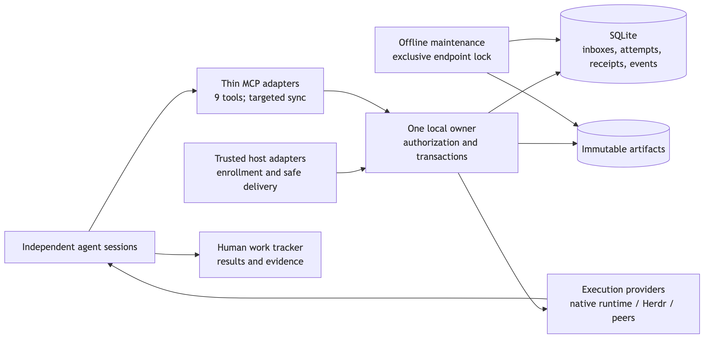

# ADR: one local coordination owner with native runtime integration

Status: implemented. The [host support matrix](runtime-host-support.md) and
[verification guide](coordination-verification.md) define the evidence boundaries.

## Decision

One Node owner per isolated profile owns SQLite mutations, domain state and event
wakeups. Thin stdio MCP adapters and runtime integrations call the same authenticated
command/query interface over a Unix socket or Windows named pipe. Native runtimes
own their children; Swarm coordinates across independent sessions and retains
acknowledged messages, fenced ownership and results.

[Diagram source](diagrams/coordination.mmd).

The owner uses TypeScript and SQLite with FULL synchronous commits. Node is the
production owner runtime; Bun and Node clients share the IPC contract. Windows
owner selection follows the retained [named-pipe reproduction](verification/2026-09-21-core/README.md):
Node handles a duplicate bind as an error in the tested environment.

## Alternatives and evidence

The [baseline experiment](verification/2026-09-21-baseline/README.md) compares
shared SQLite with per-process polling, reduced cleanup, atomic per-process writes,
and a single writer with held notification requests. The measured single-writer
fixture accepts and reads all 384 messages at 32 agents, with delivery p95 of
36–37 ms; the polling alternatives expose contention and unread accepted work.
Those are dated fixture measurements, not a guarantee for arbitrary workloads.
Current budgets and their evidence live in [benchmark acceptance](coordination-benchmarks.md).

Native runtime communication is preferred inside a managed execution tree because
it already owns child identity, cancellation and wakeups. It cannot replace durable
coordination between unrelated hosts. A distributed broker or network database adds
operational cost without addressing this local ownership and context problem;
multiple-machine storage is outside the current contract.

## Transaction and delivery invariants

- Commands validate identity and input at the owner boundary. State, events and
  idempotent receipts commit together. Stable command IDs replay accepted work;
  reusing an ID with a different payload is rejected.
- The service batches at most 32 already queued ordinary commands per event-loop
  turn, partitioned by authorized scope. Savepoints isolate command rejection;
  successful responses and notification hints follow the outer durable commit.
  Network/host calls and asynchronous artifact imports stay outside transactions.
- A fetch grants a delivery lease. Only explicit processing acknowledgment ends
  that obligation. Failed wakeups and lost responses preserve accepted work.
  Consumer-side deduplication remains necessary for external side effects.
- Session generations, task attempts and reservation fences reject superseded
  writers. Process availability, execution heartbeat, progress age and task lease
  are separate facts. A timer cannot keep stalled work alive indefinitely.
- Persisted event cursors permit reconnect replay. Notifications are hints; held
  watches avoid idle model polling. Retention overtaking a cursor requires an
  explicit resync. Maintenance preserves control identities needed for replay.
- Owner startup, stale-endpoint recovery, shutdown and offline maintenance serialize
  through an OS-backed SQLite lock. A reachable owner is never replaced.

The [inbox](durable-inboxes.md), [ownership](session-and-task-ownership.md),
[reservations](worktree-reservations.md), [evidence](retained-context.md) and
[maintenance](storage-maintenance.md) documents specify their domain contracts.

## Boundaries and trust

The domain core has no MCP or host SDK dependency. The local service owns IPC,
authorization, queues and persistence. MCP maps the nine [API tools](api.md) onto
that interface; transport negotiation never supplies durable actor identity.
These import boundaries are enforced by `test/coordination-boundaries.test.ts`.

Trusted launchers choose identity and enroll native sessions. Host adapters provide
safe context admission and verified availability observations. Execution providers
own launch/stop mechanics; dispatch persists the chosen intent before invoking one.
An uncertain start retains its capacity and is reconciled by that intent, never
silently retried through a different provider. See [execution routing](execution-routing.md).

Profiles have separate state paths, IPC endpoints and OS access controls. One local
OS user/profile is the trust boundary; labels are routing metadata, not credentials.
Reservations are cooperative, not kernel filesystem locks. Work trackers receive
human-facing evidence only under an authorized [tracker policy](linear-promotion-policy.md).
Tracker availability does not govern local message acknowledgment or task execution.

## Application boundary

`src/coordination` is the sole live coordination implementation. `swarm-mcp` and
`swarm-coordinator-mcp` select the same authenticated adapter. Native launchers own
lifecycle; optional Python hooks provide cooperative write reservations only.
Desktop/mobile products have independent repositories and are not build dependencies.

A single application boundary is preferred over maintaining two writable stores
or transparent translation. Destructive reads and unfenced ownership cannot preserve
the acknowledgment and attempt contracts, and two defaults can split peers across
unrelated state. The package supports coordinator profiles only: enrollment,
execution, diagnostics and offline maintenance all use the same application model.

Database application identity checks reject foreign stores. Numbered coordinator
schema migrations remain stable, including historical table definitions, so
existing profiles retain their data and upgrade safely. An incomplete-import marker
blocks startup rather than exposing partial state. MCP transport compatibility is
independent of the application model and supports the handshakes used by current hosts.
